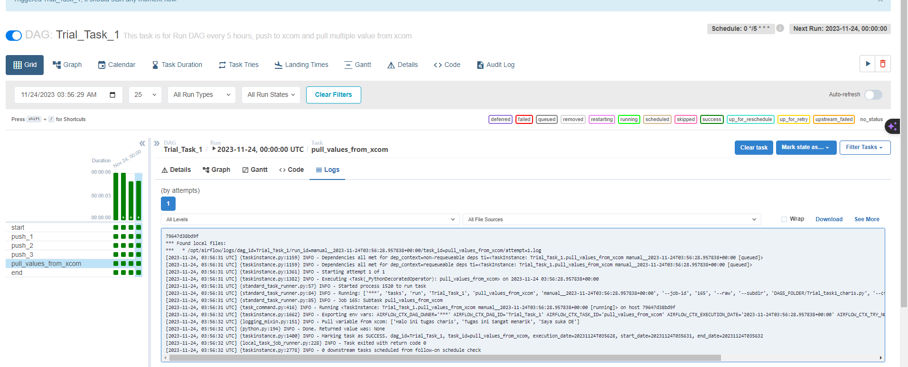
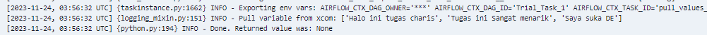

# Day-1 TASK
1. Create DAG that run in every 5 hours.
2. Suppose we define a new task that push a variable to xcom.
3. How to pull multiple values at once?

Instruction for Task Day-1
- Upload your python script and elaborate your answer.

## ANS
Semua jawaban sudah saya buat dalam file task1_charis.py. Berikut adalah hasil screenshot hasil run DAG file task1_charis.py.

Push Logs

Pull Logs

Check in xcom

