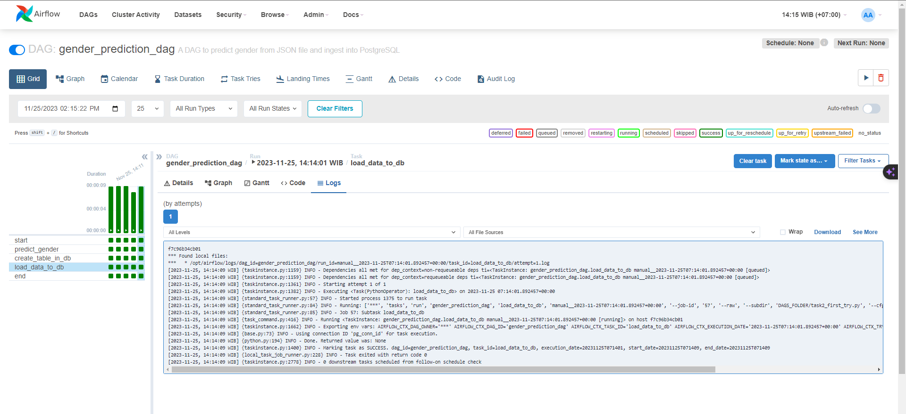
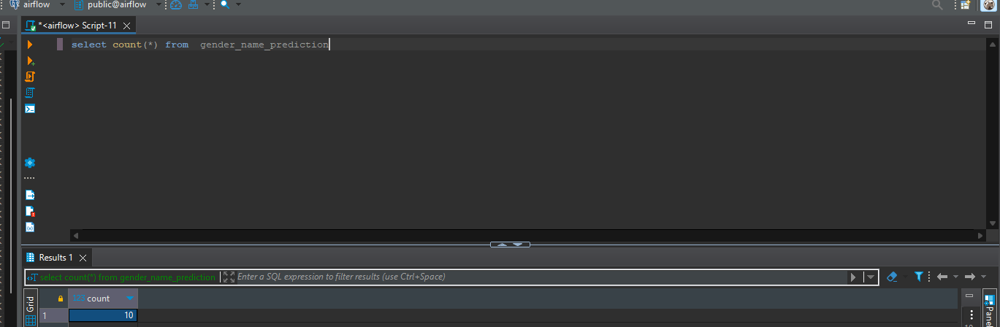
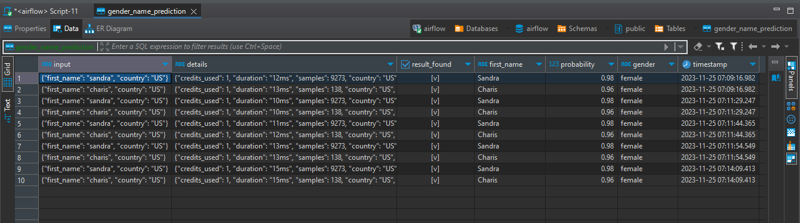

# Day-2 TASKS
Instruction for Task Day-2
- Upload your python script
- Screenshot the result on Airflow dashboard and the number of rows from DBeaver, then upload the result's screenshot.

Create a DAG that contain several tasks: 

- A task that predict multiple names from gender-api with SimpleHTTPOperator, refer to this [API documentation](https://gender-api.com/v2).

- A task to create table in postgresql. Suppose the prediction result returned a json data like below.

    ```
    [
        {
            "input": {
                "first_name": "sandra",
                "country": "US"
            },
            "details": {
                "credits_used": 1,
                "duration": "13ms",
                "samples": 9273,
                "country": "US",
                "first_name_sanitized": "sandra"
            },
            "result_found": true,
            "first_name": "Sandra",
            "probability": 0.98,
            "gender": "female"
        }
    ]
    ```
    Create a table with columns: `input`, `details`, `result_found`, `first_name`, `probability`, `gender` and `timestamp`. Timestamp refers to the time where the data is loaded to Postgre. Please define the appropriate data type for each column.

- A task that will load all the prediction result to table `gender_name_prediction` postgresql with `PostgresHook`. Duplication data are allowed.

## Ans
**Dashboard result on airflow**



**Number of rows**



**Result**


